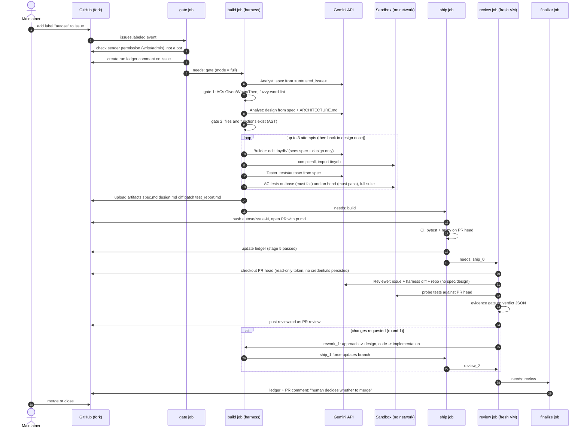

# Sequence view

> Planned sequence; will be replaced by the sequence of a real run (link) once executed.

```mermaid
sequenceDiagram
  autonumber
  actor M as Maintainer
  participant GH as GitHub (fork)
  participant G as gate job
  participant B as build job (harness)
  participant L as Gemini API
  participant S as Sandbox (no network)
  participant R as ship job
  participant V as review job (fresh VM)
  participant F as finalize job

  M->>GH: add label "autose" to issue #N
  GH->>G: issues.labeled event
  G->>GH: check sender permission (write/admin), not a bot
  G->>GH: create run ledger comment on issue
  G->>B: needs: gate (mode = full)
  B->>L: Analyst: spec from <untrusted_issue>
  B->>B: gate 1: ACs Given/When/Then, fuzzy-word lint
  B->>L: Analyst: design from spec + ARCHITECTURE.md
  B->>B: gate 2: files and functions exist (AST)
  loop up to 3 attempts (then back to design once)
    B->>L: Builder: edit tinydb/ (sees spec + design only)
    B->>S: compileall, import tinydb
    B->>L: Tester: tests/autose/ from spec
    B->>S: AC tests on base (must fail) and on head (must pass), full suite
  end
  B->>GH: upload artifacts spec.md design.md diff.patch test_report.md
  B->>R: needs: build
  R->>GH: push autose/issue-N, open PR with pr.md
  R->>R: CI: pytest + mypy on PR head
  R->>GH: update ledger (stage 5 passed)
  R->>V: needs: ship_0
  V->>GH: checkout PR head (read-only token, no credentials persisted)
  V->>L: Reviewer: issue + harness diff + repo (no spec/design)
  V->>S: probe tests against PR head
  V->>V: evidence gate on verdict JSON
  V->>GH: post review.md as PR review
  alt changes requested (round 1)
    V->>B: rework_1: approach -> design, code -> implementation
    B->>R: ship_1 force-updates branch
    R->>V: review_2
  end
  V->>F: needs: review
  F->>GH: ledger + PR comment: "human decides whether to merge"
  M->>GH: merge or close
```
